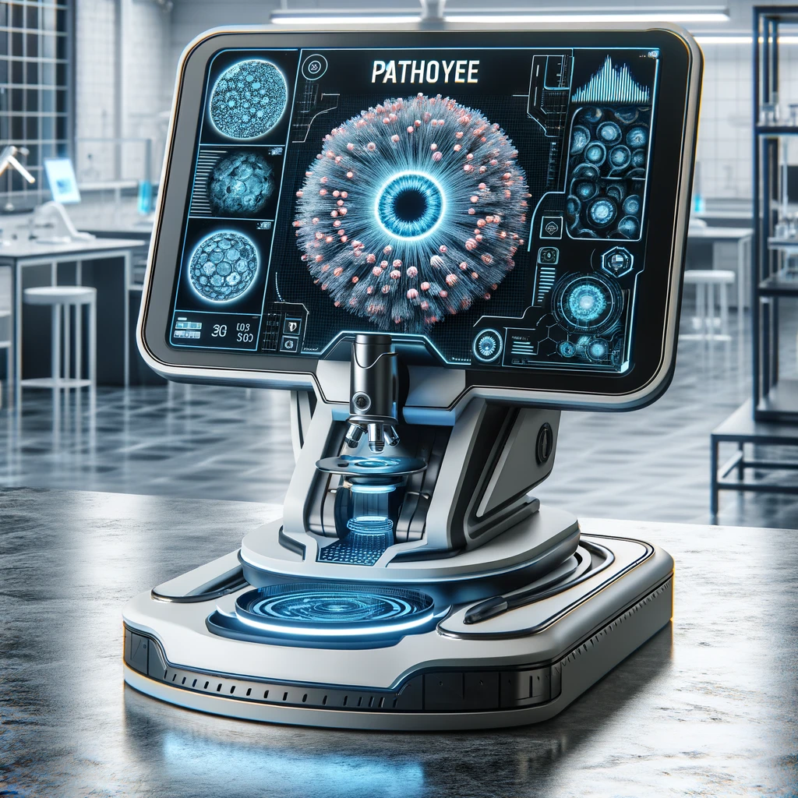

## Table of Contents

- [Background](#background)
- [Data](#Data)
- [Install](#Install)
- [Example](#example-readmes)
- [Maintainers](#maintainers)
- [Contributing](#contributing)
- [License](#license)

## Background
This is an open-source Python3 pipeline for auto diagnosis pathology based on radiomics features.

The target of radiomics features is to extract biological features (also known as features) from CT, MRI, PET images. However, we found that those feature described first-order statistics and texture features which may be used to describe pathology whole-slide image. So we applied them to extract pathology image features and used those feature to describe different image.

We highly recommend using Linux for running this pipeline.

## Data
This data can be downloaded from https://gtexportal.org/home/histologyPage

## Install
Make sure you have installed all the package that were list in requirements.txt
```
conda create -n patheye python==3.8
pip install -r requirements.txt
conda activate patheye
```

# Example

## Step by step

### sample image
Make sure you have downloaded dataset from https://gtexportal.org/home/histologyPage and saved them in your computer.
First you should use create_patches.py to sample images on whole-slide image,

```sh
python create_patches.py -input_path /your_download_dataset_path -save_path /the_path_you_want_to_save_output -device cuda:0
```
## Train model
After you have completed the image segmentation, you can implement image filtering. In this part, you should run 02_select_128_image.py and 02_select_512_image.py to filte the image with two size(128*128,512*512), which were generated from 01_cut_image.py
```sh
python train.py -train_path /this data was generated by create_patches.py -val_path /this data was generated by create_patches.py -save_path ./the path to save model
```

### image classify
After finished traing model, you can use your model to classify image.
```sh
python inference.py -input_path /a image path, this image should be a format of svs of ndpi -model_path /the path of save model, which was saved by train.py -save_path ./the path to save result
```


## Maintainer

[@Yusen Lin](https://github.com/lysovosyl)


### Contributors

Thank you to the following people who participated in the project：
Jiajian Zhou、Yongjun Zhang、Feiyan Lin

## License

[MIT](LICENSE) © Yusen Lin
