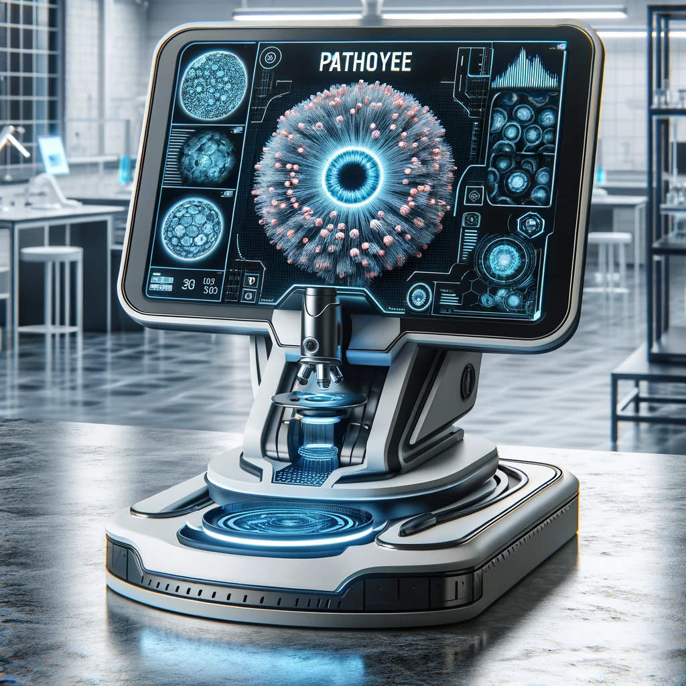

## Table of Contents

- [Background](#background)
- [Data](#Data)
- [Install](#Install)
- [Example](#example-readmes)
- [Maintainers](#maintainers)
- [Contributing](#contributing)
- [License](#license)

## Background
This is an open-source Python3 pipeline for auto diagnosis pathology based on radiomics features.

The target of radiomics features is to extract biological features (also known as features) from CT, MRI, PET images. However, we found that those feature described first-order statistics and texture features which may be used to describe pathology whole-size image. So we applied them to extract pathology image features and used those feature to describe different image.

We highly recommend using Linux for running this pipeline.

## Data
This data can be downloaded from https://gtexportal.org/home/histologyPage

## Install
Make sure you have installed all the package that were list in requirements.txt
```
pip install -r requirements.txt
```

# Example

## Step by step

### Image segmentation
Make sure you have downloaded dataset from https://gtexportal.org/home/histologyPage and saved them in your computer.
First you should use 01_cut_image.py to implement segmentation on whole-slide image

```sh
python 01_cut_image.py -input_path /your_download_dataset_path -save_path /the_path_you_want_to_save_output
```
## Filted image
After you have completed the image segmentation, you can implement image filtering. In this part, you should run 02_select_128_image.py and 02_select_512_image.py to filte the image with two size(128*128,512*512), which were generated from 01_cut_image.py
```sh
python 02_select_128_image.py -input_path /the_path_you_want_to_save_output/128/ -save_path /the_path_you_want_to_save_filted_128*128_image
python 02_select_512_image.py -input_path /the_path_you_want_to_save_output/512/ -save_path /the_path_you_want_to_save_filted_512*512_image
```

### Extract image features
Next, you should run 03_pyradiomic.py to extract image features.
```sh
python 03_pyradiomic.py -input_path /the_path_you_want_to_save_filted_128*128_image -save_path /the_path_you_want_to_save_features_128*128_image -config_path /config/original.yaml -mask_path /mask/mask_128.nii
```

### Make training and testing dataset
To make dataset, which can be used to train your model, you should run 04_make_deeplearning_dataset.py and 04_make_RandomForest_dataset.py
```sh
python 04_make_deeplearning_dataset.py -input_path /the_path_you_want_to_save_output/128/ -label_path /label/Sun_Exposed_Lower_leg_hist.txt -save_path /the_path_save_dl_dataset
python 04_make_RandomForest_dataset.py -input_path /the_path_you_want_to_save_features_128*128_image -label_path/Sun_Exposed_Lower_leg_hist.txt -save_path /the_path_save_rf_dataset
```
train_features.csv
### Train model
Next, you can train DL model and RF model
```sh
python 05_train_DCNN.py 
-train_path1 /the_path_save_dl_dataset/train/20 \
-train_path2 /the_path_save_dl_dataset/train/70 \
-test_path1 /the_path_save_dl_dataset/test/20 \
-test_path2 /the_path_save_dl_dataset/test/70 \
-save_path /the_path_save_dl_model/

python 05_train_RandomForestClassifier.py -input /the_path_save_rf_dataset/train_features.csv -output /the_path_save_rf_model
```
### Tracing hotspot
To tracing hotspot, you should make sure you have trained DL model and save the model, next run 06_visualize_hotspot.py
```
python 06_visualize_hotspot 
-data1_path /the_path_save_dl_dataset/test/20 \
-data2_path /the_path_save_dl_dataset/test/70 \
-model_path /the_path_save_dl_model/model.pth \
-save_path /the_path_save_hotspot_image/
```

## Maintainer

[@Yusen Lin](https://github.com/lysovosyl)


### Contributors

Thank you to the following people who participated in the project：
Jiajian Zhou、Yongjun Zhang、Yan Lin

## License

[MIT](LICENSE) © Yusen Lin
